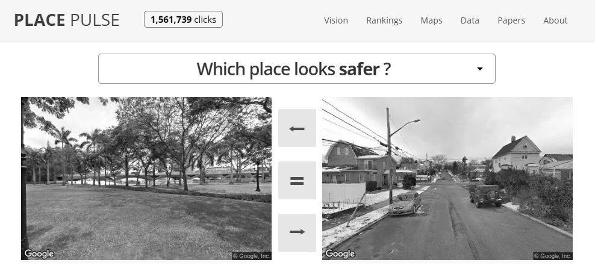

```{r setup, include=FALSE}
knitr::opts_chunk$set(echo = TRUE, message = FALSE, warning = FALSE)
library(ggplot2)
library(sf)
library(ineq)
library(lubridate)
library(tidyr)
library(dplyr)
```

```{r, include=FALSE}
options(tinytex.verbose = TRUE)
```

# 1. Introduction 

What is crowdsourcing?

What types of data are commonly crowdsourced?

# 2. Strengths and weaknesses of crowdsourced data

@solymosi2020 STRENGTHS

Capture the spatial-temporal specific nature of attitudes and emotions towards crime.	23/27
Record data on individual variables and specific types of fear/disorder.	12/27
Record data on architectural features.	20/27
Reduced cost of data collection.	11/27


WEAKNESSES

Self-selection bias:
males tend to be more represented than females, and young citizens are overrepresented compared to older groups @chataway2017
check @salesses2013

Participation inequality:
FixMyStreet data, one fourth of all reports had been produced by one percent of users, while 73% of people in the sample contributed only once (@solymosi2017).

Under-representation of certain areas

Participation decrease, sample attrition over time @solymosi2020 @blom2010

Repeatedly asking about fear might increase/cause fear

Lack of temporal variability in some web-based measures 

Validity of measures

# 3. Crowdsourcing perceptions of safety: Step-by-step example in R

In order to illustrate the use of crowdsourced data in criminological research, we present below an exemplar study using data recorded by the Place Pulse 2.0 platform. This section will introduce the Place Pulse project and provide `R` codes to download, explore and clean this source of crowdsourced data. Then, we will analyse the spatial distribution of crowdsourced perceptions of space and safety in Atlanta, Georgia, and illustrate with examples some known issues of crowdsourced data (i.e., participantion inequality, participation decrease and measure validity).

## 3.1 The Place Pulse project

Place Pulse 2.0 was an online crowdsourcing platform designed to record data about citizens' perceptions of safety, beauty, wealth, liveability, boredom and depression. Two images obtained were shown to participants, who then were asked ‘Which place looks safer?’ (see Figure 1). The platform could also be used to report which of the two images looked wealthier, more beautiful, more boring, livelier or more depressing, but we will focus on the 'safer' answers in this chapter. Images were selected randomly from Google Street View across 56 cities from 28 countries, and these captions were originally taken between 2007 and 2012. The platform recorded all responses in a public dataset, but responders did not provide any further information about themselves, which means that we do not know their social and demographic characteristics. Place Pulse used to be hosted in an open website (http://pulse.media.mit.edu/) and anyone could use it, but the platform was closed in 2019. We have been granted access to all the data recorded between the 28th May 2013 and the 22nd August 2019 to write this chapter, which has been uploaded onto an open repository with consent of the data producers [@salesses2013].



## 3.2 Download and explore Place Pulse data

We have saved all Place Pulse data in a data repository on FigShare. You can download this directly into R by using the `read.csv()` function. It is a large file so it may take some minutes to read in, be patient!

```{r readpp}

pp_data <- read.csv('https://ndownloader.figshare.com/files/21739137') 

```

This data set includes 17 variables, but we will only use some of them. A unique identification code was given to each participant (i.e., 'voter_uniqueid') and image (i.e., 'place_id_left' for images in the left side of the pairwise comparison and 'place_id_right' for images in the right part). The columns 'place_name_left' and 'place_name_right' specify the city of each photograph. The column 'choice' shows if the user perceived the image in the left or right to be 'safer' (participants could also answe 'equal'), and the column 'study_question' allows us to study perceptions about different variables (e.g., safety, wealth, beauty). The strings 'day' and 'time' specify the moment when each vote toke place, and the columns 'long_right', 'lat_right', 'long_left' and 'lat_left' show the longitude and latitude of both images.

We can begin by examining which cities were more frequenty assessed within the Place Pulse platform. This can be checked first for images in the left side of the pairwise comparison, and then for images in the right. We can use the `top_n()` function from `dplyr` package to check this:

```{r top5placeleft}

pp_data %>%
  group_by(place_name_left) %>%
  summarize(Count = n()) %>%
  top_n(5)

```

Atlanta was the city with a largest number of votes amongst those images that appeared in tge left part of the comparison, but we can also check this for those images shown in the right side:

```{r top5placeright}

pp_data %>%
  group_by(place_name_right) %>%
  summarize(Count = n()) %>%
  top_n(5)

```

Atlanta was indeed the city with the largest number of votes. We can also check which variables were more frequently assessed by participants:

```{r topstudyquestions}

pp_data %>%
  group_by(study_question) %>%
  summarize(Count = n())

```

We can see that safety was the most commonly assessed variable, with 509,961 votes in total. In this book chapter we will examine reports of safety in the city of Atlanta. Before analysing the data, however, we can also examine if participants were more inclined to vote for images in the left or right part of the platform.

```{r topchoice}

pp_data %>%
  group_by(choice) %>%
  summarize(Count = n()) %>%
  top_n(3)

```

The frequency of votes for left and right options is very similar, which shows that the position of the image does not appear to have an affect on participants' votes.

## 3.3 Cleaning Place Pulse data

When it comes to crowdsourced data, you will have to be an expert data wrangler to make sure you can get the data to behave like you want it to - in other words, to make the data available in a format that allows you to answer your research questions. For example, in this case, we want to map the perceived safety of areas in Atlanta. To do this, first we have to select the area of Atlanta and the votes about safety.

Atlanta is the capital city of the American State of Georgia. In 2018, its estimated papulation was close to 500,000 residents, and thus it is the 37th most populated city in the United States. There are two main reasons why we are conducing this exemplar study in Atlanta: first, as shown above, it was the city with the largest number of votes in the Place Pulse platform, and second, there is available open data at a detailed geographical scale about its social, demographic and crime characteristics that can be easily used to explain the patterns observed in Place Pulse data. Moreover, various papers have analysed the predictors of crime and fear of crime in this city, which can be used to interpret our results [see @mcnulty2000, @tester2011]

We can use the function `read.csv()` to create a new dataframe that includes those pairwise comparisons in which either the image of the right or the image of the left, or both, are from Atlanta.

```{r getatlandapp}

pp_atl <- pp_data[which(pp_data$place_name_right == "Atlanta" | pp_data$place_name_left == "Atlanta"), ]

```

We will also focus on the ratings of areas as safer, as we are interested in people's perceptions of place and safety: 

```{r getsafetyq}

pp_atl_s <- pp_atl[ which(pp_atl$study_question == "safer"), ]

```

You can see now we have a dataframe of `r nrow(pp_atl_s)` votes about the safety of places in Atlanta.

We are interested in analysing the proportion of 'safer' votes in each neighbourhood of Atlanta. In order to assign each photograph to their neighbourhood, we will create two new columns that specify the longitude and latitude of the image of Atlanta being assessed. We will also create a new column that details whether each participant voted that the image of Atlanta was 'safer' or 'not safer' than the other picture. Some pairwise comparisons, however, assessed two images from Atlanta, which means that we will need to duplicate these votes to account for both the image assessed as 'safer' and the picture reported to be 'not safer'. First, we want to know the number of comparisons in which both images are from Atlanta.

```{r counttwoatlanta}

table(pp_atl_s$place_name_right == "Atlanta" & pp_atl_s$place_name_left == "Atlanta") #count votes in which both images are from Atlanta

```

In total, 678 pairwise comparisons are based on two images from the city of Atlanta, whereas 36,536 compare one image from Atlanta with a picture from any other city. We will duplicate those comparisons in which both images were taken in Atlanta and attach them to two new datasets (one to assess the images on the right, and the other to report the images on the left). For now, we delete these cases from the main dataframe, but we will merge them once all the data has been cleaned.

```{r duplicatedatatwoatlanta}

pp_atl_s <- pp_atl_s[order(pp_atl_s$X), ] #order file by vote number

pp_atl_s_dup <- pp_atl_s[which(pp_atl_s$place_name_right == "Atlanta" & pp_atl_s$place_name_left == "Atlanta"), ] #new dataset: both images are from Atlanta
pp_atl_s_dup2 <- pp_atl_s_dup #duplicate new dataset

pp_atl_s <- pp_atl_s[!(pp_atl_s$X %in% pp_atl_s_dup$X), ] #delete duplicated votes from main dataset

```

Now, the main dataset only includes those pairwise comparison in which only one image was from Atlanta. We create two new columns that specify the coordinates of the picture from Atlanta. First, we allocate the coordinates to those votes in which the image of the left is from Atlanta:

```{r coordsleftpic}

pp_atl_s$long_Atl[pp_atl_s$place_name_left == "Atlanta"] <- pp_atl_s$long_left[pp_atl_s$place_name_left == "Atlanta"]
pp_atl_s$lat_Atl[pp_atl_s$place_name_left == "Atlanta"] <- pp_atl_s$lat_left[pp_atl_s$place_name_left == "Atlanta"]

```

We then reproduce the same step with those votes in which the image of the right side of the comparison is from Atlanta:

```{r coordsrightpic}

pp_atl_s$long_Atl[pp_atl_s$place_name_right == "Atlanta"] <- pp_atl_s$long_right[pp_atl_s$place_name_right == "Atlanta"] 
pp_atl_s$lat_Atl[pp_atl_s$place_name_right == "Atlanta"] <- pp_atl_s$lat_right[pp_atl_s$place_name_right == "Atlanta"]

```

Remember that we had previously created two new datasets with those votes in which both images are from Atlanta. The first dataset ('pp_atl_s_dup') will be used to assess the images in the left, while the second dataset ('pp_atl_s_dup2') refers to the images in the right. We can then allocate the coordinates of the left image to first dataset of votes in which both images are from Atlanta:

```{r coordslefttwoatlanta}

pp_atl_s_dup$long_Atl <- pp_atl_s_dup$long_left
pp_atl_s_dup$lat_Atl <- pp_atl_s_dup$lat_left

```

And then we allocate the coordinates of the right image to the second dataset of pairwise comparisons between Atlanta pictures:

```{r coordsrighttwoatlanta}

pp_atl_s_dup2$long_Atl <- pp_atl_s_dup2$long_right
pp_atl_s_dup2$lat_Atl <- pp_atl_s_dup2$lat_right

```

Before merging all the data into a single dataset, we will create a new column that distinguishes those images of Atlanta that were assessed as 'safer' from those reported as "less safe' or 'equal'. We can do this first in the main dataset (which only includes pairwise comparisons with one picture from Atlanta), by checking if the choice of each vote (i.e., 'left', 'right', or 'equal') corresponds to the position of the image from Atlanta. We assign a 1 when the user's vote corresponds to the position of the image of Atlanta, whereas a 0 is assigned when the image of a different city was chosen to be 'safer' and when users voted 'equal'.

```{r assign1or0}

pp_atl_s$win[pp_atl_s$place_name_left == "Atlanta" & pp_atl_s$choice == "left"] <- 1
pp_atl_s$win[pp_atl_s$place_name_left == "Atlanta" & pp_atl_s$choice == "right"] <- 0
pp_atl_s$win[pp_atl_s$place_name_left == "Atlanta" & pp_atl_s$choice == "equal"] <- 0

pp_atl_s$win[pp_atl_s$place_name_right == "Atlanta" & pp_atl_s$choice == "right"] <- 1
pp_atl_s$win[pp_atl_s$place_name_right == "Atlanta" & pp_atl_s$choice == "left"] <- 0
pp_atl_s$win[pp_atl_s$place_name_right == "Atlanta" & pp_atl_s$choice == "equal"] <- 0

```

Similarly, in the 'pp_atl_s_dup' dataset, we can assign a 1 to those cases in which participants voted that the left image looked 'safer' and a 0 otherwise, given that this dataset has been previously created to assess the images of the left of pairwise comparisons in which both images were from Atlanta. And we can do the same with the second dataset that compares two images from Atlanta, which in this case refers to the image in the right.

```{r assign1or0twoatlanta}

pp_atl_s_dup$win[pp_atl_s_dup$choice == "left"] <- 1
pp_atl_s_dup$win[pp_atl_s_dup$choice == "right"] <- 0
pp_atl_s_dup$win[pp_atl_s_dup$choice == "equal"] <- 0

pp_atl_s_dup2$win[pp_atl_s_dup$choice == "right"] <- 1
pp_atl_s_dup2$win[pp_atl_s_dup$choice == "left"] <- 0
pp_atl_s_dup2$win[pp_atl_s_dup$choice == "equal"] <- 0

```

Now that our dataset has been cleaned and is ready to be analysed, we can merge all the data together wit the `rbind()` function.

```{r merge}

pp_atl_s <- rbind(pp_atl_s, pp_atl_s_dup, pp_atl_s_dup2) 

```

We have a dataframe of `r nrow(pp_atl_s)` votes about the safety in Atlanta that is ready to be analysed.

## 3.4 Map Place Pulse data

It is possible to use mapping techniques learned in other chapters (LINK WITH MAPPING CHAPTER) to map the crowdsourced data [@solymosi2015]. We will be using the `sf` and `ggplot2` libraries in order to create a map of perceived safety of built environment across the city of Atlanta.

First, acquire a shapefile for Atlanta. Let's use the census tracts shapefile from Harvard University. You can go on their website to find out more about this boundary data: [https://worldmap.harvard.edu/data/geonode:Atlanta_Census_Tracts_SHL](https://worldmap.harvard.edu/data/geonode:Atlanta_Census_Tracts_SHL). We can download the shapefile directly using their Application Programme Interfact (or API) - this is something discussed in greater detail on the chapter on Open Data (CHAPTER REF). For now, you can just use the code below, with the `st_read()` function in the `sf` package: 

```{r loadshapefile}

atl <- st_read("http://worldmap.harvard.edu/download/wfs/1824/json?outputFormat=json&service=WFS&request=GetFeature&format_options=charset%3AUTF-8&typename=geonode%3AAtlanta_Census_Tracts_SHL&version=1.0.0")

```

We can see what this looks like by using the `plot()` function to plot the geometry of the 'atl' object we created, called with the `st_geometry()` function: 

```{r plotatlgeom}

plot(st_geometry(atl))

```

Now, to be able to plot the safety votes on this map, we first need to make our votes a spatial object, by specfying that the "long_Atl" and "lat_Atl" columns contain our longitude and latitude information. We use the `st_as_sf()` function for this: 

```{r geocodepp}

points_atl_s <- st_as_sf(pp_atl_s, coords = c("lat_Atl", "long_Atl")) #geocode 'safe' votes in Atlanta

```

Now to be able to plot both these spatial layers on the same map, their coordinate reference systems (CRS) need to match. We can check these with the `st_crs()` function: 

```{r checkcrs}

st_crs(points_atl_s) == st_crs(atl) #check if coordinate reference system is the same of both layers

```

We function tells us that it is 'false' that both CRS are not equal, but we can change this with the following line of code:

```{r changecrs}

st_crs(points_atl_s) <- st_crs(atl)

```

Now, if we check, they should have the same CRS: 

```{r checkcrs2}

st_crs(points_atl_s) == st_crs(atl) #check if coordinate reference system is the same of both layers

```

Now we can map our data. See (LINK WITH MAPPING CHAPTER) for more information about crime mapping.

```{r plotpoints}

map <- ggplot(data = atl) + geom_sf() + theme_void() +
  coord_sf(xlim = c(-84.7, -84), ylim = c(33.6, 34), expand = FALSE) #create map
  
map + geom_point(data = pp_atl_s, aes(x = lat_Atl, y = long_Atl), size = .1) #plot map with points

```

This is a very busy map. Maybe instead we want to get some sort of average score for each census tract. We then calculate the proportion of 'safer' responses in each area. Note that @salesses2013 suggest computing a Q-score per image corrected by the "win" and "loss" ratio of all photographs with which it is compared, but for the purpose of this chapter we will compute a simple proportion that will allow us to directly analyse the geographical distribution of perceived safety. 

```{r calcwinscore}

points_atl_s_nhood <- st_intersection(atl, points_atl_s) %>% 
  group_by(TRACT) %>% 
  summarise(winscore = mean(win, na.rm = TRUE), 
            num_votes = n())

```

And we can add the average score of 'safer' reponses per area to the original shapefile of census tracts. We will also delete those census tracts in which we do not have any assessed of perceived safety.
 
```{r joinwin}

st_geometry(points_atl_s_nhood) <- NULL

atl_pp_wins <- left_join(atl, points_atl_s_nhood, by = c("TRACT" = "TRACT"))

atl_pp_wins <- atl_pp_wins[!is.na(atl_pp_wins$winscore), ]

```

Finally, we can plot the propotion of 'safer' votes in each census tract.

```{r mapwins}

ggplot(data = atl_pp_wins) + 
  geom_sf(aes(fill = winscore)) +
  coord_sf(xlim = c(-84.7, -84), ylim = c(33.5, 34), expand = FALSE) +
  theme_void() 

```

There are many more things one can do with these data. For example, we could look at the descriptive statistics and boxplot of the proportion of 'safer' votes in each area: 

```{r}

summary(atl_pp_wins$winscore) #descriptive statistics of proportion of 'safer' votes per tract

p <- ggplot(atl_pp_wins, aes(y = winscore))
p + geom_boxplot() + ggtitle("Boxplot of percentage of 'safer' votes per area") #boxplot

```

You can do much more, but here we will focus on the specific issues to explore due to the crowdsourced nature of these data.

## 3.5 Exploring the known issues of crowdsourced data within Place Pulse

In section 2, we mentioned a few issues that are usually present in crowdsourced data, and which are important to keep in mind when ussing these data in criminological research. Here we explore whether some of these issues are present in Place Pulse, and what that might mean for any conclusions we draw from our analyses. We shall keep in mind that the Place Pulse project did not record information about participants demographic characteristics, and thus we cannot direclty examine the self-selection biases that may affect this dataset. Nevertheless, the sample's self-selection biases should be checked when possible. Here we will examine whether our sample size is affected by participation inequality, under-representation of certain areas and participation decrease. We will also study the validity of this crowdsourced data as a measure of perceived safety.

### 3.5.1 Participation inequality (supercontributors)

Crowdsourced data is usually affected by a few number of supercontributors that produce most votes. In order to check if our dataset is affected by this, we first need to create a new dataframe showing the number of votes that each study participant had made. To do this, we will use code from the `dplyr` library:

```{r create voter table}

voter <- pp_data %>% 
  group_by(voter_uniqueid) %>% 
  summarise(num_votes = n())

```

If you want, you can have a look at this new dataframe using the `View()` function. If you do this, you might see, we have some very active participants. The top voter, for instance, has made `r voter %>% arrange(-num_votes) %>% head(1) %>% pull(num_votes)` votes on places. That is some very prolific participation! On the other hand, you can also see that `r nrow(voter %>% filter(num_votes == 1))` of the participants made only one vote. We are definitely seeing signs of participation inequality in these data. 

In fact, we can examine how much of the votes are produced by these "supercontributors". For example, we can assess the proportion of votes made by the top 1% of voters. We can do this using the `subset()` and `quantile()` functions:

```{r top1perc}

top_1percent <- subset(voter, num_votes > quantile(num_votes, prob = 1 - 1/100)) 

```

We can see that this new dataframe contains 954 people, who are our top 1% contributors to the Place Plus dataset. We will now examine how much of the total number of votes are generated by the top 1% of users:

```{r top1perccontrib}

sum(top_1percent$num_votes) / sum(voter$num_votes) * 100

```

That is a lot: `r round(sum(top_1percent$num_votes) / sum(voter$num_votes) * 100, 2)`% of the votes are made by the top 1% of contributors.

#### Activity 1

Can you tell me what proportion of the votes were made by the top 10% of participants? What about the top 25%? 

```{r activity1, echo = FALSE, eval=FALSE}

top_10percent <- subset(voter, num_votes > quantile(num_votes, prob = 1 - 10/100)) #subset top 10% participants

sum(top_10percent$num_votes) / sum(voter$num_votes) * 100 #Proportion of votes by top 10% participants

top_25percent <- subset(voter, num_votes > quantile(num_votes, prob = 1 - 25/100)) #subset top 25% participants

sum(top_25percent$num_votes) / sum(voter$num_votes) * 100 #Proportion of votes by top 25% participants

```

### 3.5.2 Quantifying participation inequality

One way to quantify the extent to which participation inequality exists in our data is by using a Gini index, and visualising it using a Lorenz curve. The Gini index (or Gini ratio) is a measure of statistical dispersion intended to measure inequality. Although it tends to be used to examine income inequality, it has also been freunqtly used to assess participation inequality in crowdsourcing platforms [see @solymosi2017]. Similarly, the Lorenz curve is a visual representation of inequality. For this you will need the library `ineq` so if you do not already have this you must install with the command: 

```{r, eval = FALSE}

install.packages("ineq") 

```

Then you can load this library and calculate the index using the `Gini()` function: 

```{r gini}

Gini(voter$num_votes)

```

Remember that a score of 0 is perfect equality (everyone makes equal number of votes), while 1 is perfect inequality (only one person making all the reports, and no one else making any). Our answer of `r round(Gini(voter$num_votes), 2)` shows some serious inequality. To put this into context, in 2017, according to the OECD, income inequality in the United States of America showed a Gini coefficient of 0.39.  
To visualise this we can use a Lorenz curve using the `plot()` and `Lc()` functions: 

```{r lorenz}

plot(Lc(voter$num_votes), xlab = "Cumulative share of participants from lowest to higher number of votes",
     ylab = "Cumulative share of votes",col="darkred",lwd=2) 

```

The Lorenz curve (red line) above shows how the top few percent of reporters contribute the majority of the reports. If we had perfect equality, we would expect to see the red line align perfectly with the black line with the slope of 1. 

With this information we can now quantify how severe the participation inequality in our data, and compare with other crowdsourced data for context and understanding. 

### 3.5.3 Under-representation of certain areas

It is also important to consider variation in the sample size of number of votes in each neighbourhood:

```{r samplesize}

summary(atl_pp_wins$num_votes)

```


CONTINUE HERE!!


Talk a little about the issues with this and then discuss this:
Note: Buil-Gil et al. (2020) @builgil2020 propose a new method to compute estimates for areas with small sample sizes


### 3.5.4 Study participation descrease in Place Pulse

!!!This should also be broken up and motivated/exaplained!!!

```{r datestuff}

by_day <- pp_data %>% 
  mutate(day = ymd(day)) %>% 
  group_by(day) %>% 
  summarise(num_votes = n()) %>% 
  complete(day = seq.Date(min(day), max(day), by="day")) %>% 
  mutate(num_votes = replace_na(num_votes, 0))


ggplot(by_day, aes(x = day, y = num_votes)) + 
  geom_line() + 
  geom_smooth(lwd = 1.5, col = "red") + 
  theme_bw() + 
  xlab("Days since website launch") + 
  ylab("Number of votes") 

```

Note: large peak beginning on July 24th 2013: publication of @salesses2013 on July 24th and press release via MIT News (http://news.mit.edu/2013/quantifying-urban-perceptions-0724)
Note: large peak beginning on October 15th 2014: publication of @Harvey2014 MSc thesis


### 3.4.5 Measure validity

Validity of an assessment is the degree to which it measures what it is supposed to measure. 

# Wrap-up/Where to next:

## Open topics in crowdsourced data

## Further applications to crime and place research
